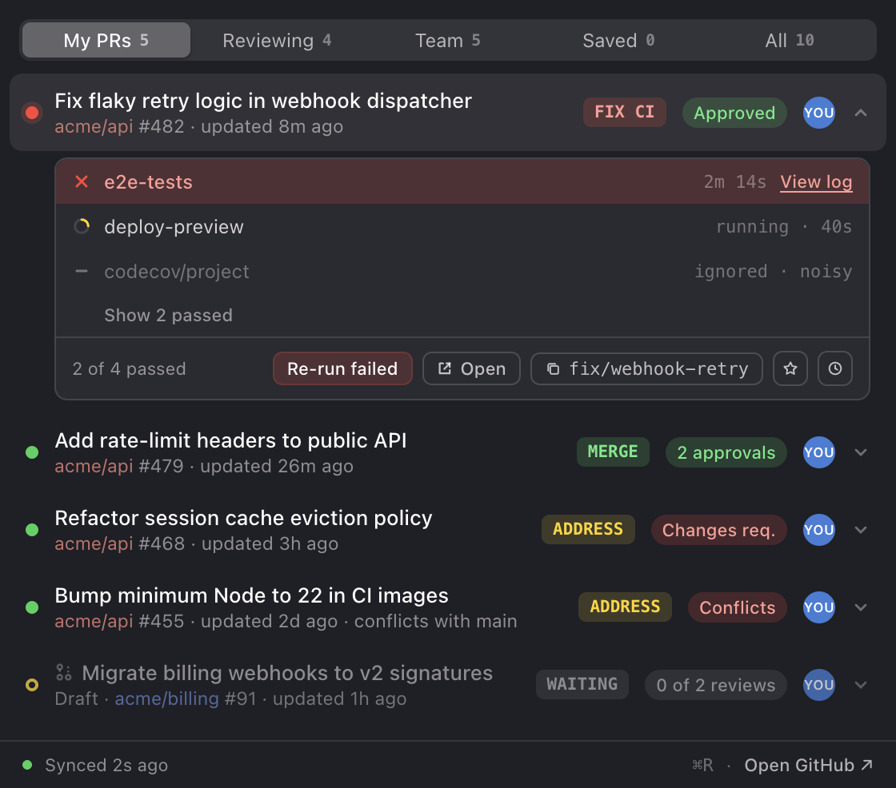
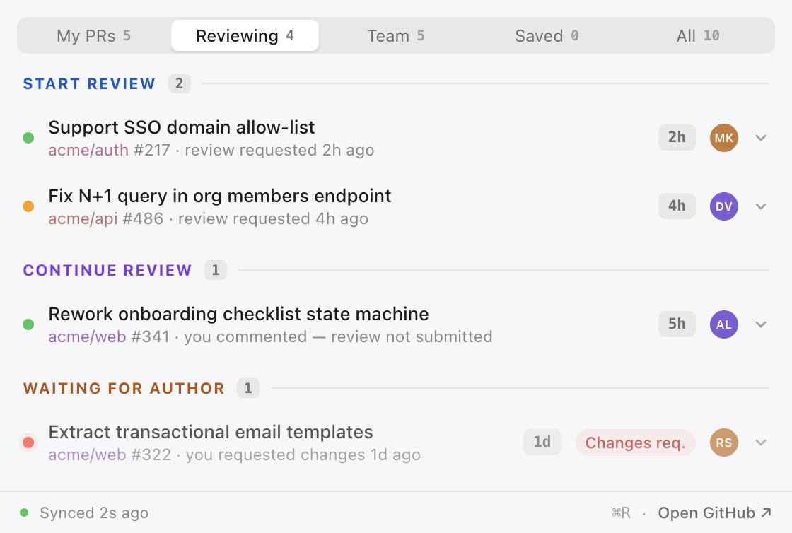
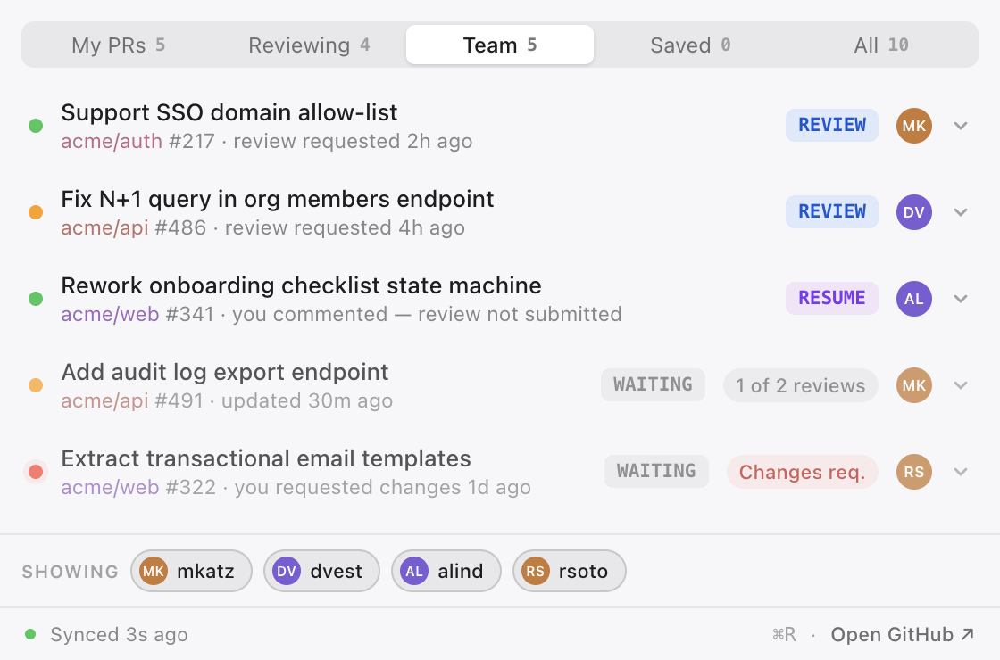
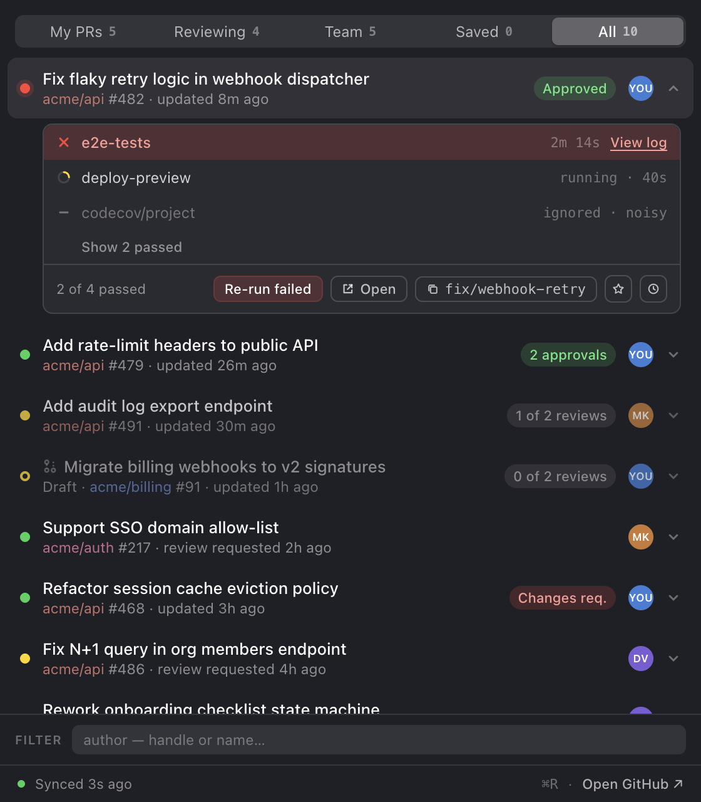

# PR Menubar

macOS menubar app for monitoring GitHub PRs. The popover answers one question: **what should I do next on my PRs?**

Every PR gets a computed **next action** — `FIX CI` / `MERGE` / `ADDRESS` / `REVIEW` / `RESUME` / `WAITING` — that drives the action chips, sort order, tray badge count, and notifications. A noisy-checks rule keeps flaky reporters (coverage bots, quarantined specs) from ever paging you.

Built with Electron (Tray + native-vibrancy popover) · React · TypeScript · electron-vite. The original design handoff and interactive prototype live in [design/](design/HANDOFF.md).

## Screenshots

*Captured by the app itself on its mock dataset (`PRMB_MOCK=1 PRMB_SHOOT=1 electron out/main/index.js` regenerates them). The native vibrancy blur doesn't survive capture — panels look flat here.*

| My PRs — expanded CI breakdown (dark) | Reviewing — grouped, with wait-time badges (light) |
|---|---|
|  |  |

| Team — person toggles (light) | All — every open PR, author filter (dark) |
|---|---|
|  |  |

## The next-action engine

Each PR is classified by the first matching rule:

| Chip | Condition |
|---|---|
| `FIX CI` | my PR, a *meaningful* (non-noisy) check failed — reported immediately, even mid-run |
| `MERGE` | my PR, approved, checks green, no conflicts |
| `ADDRESS` | my PR: changes requested, unresolved review threads, or merge conflicts |
| `REVIEW` | review requested from me, not started |
| `RESUME` | I have an unsubmitted (pending) review draft, commented without submitting, or real commits landed after my last review |
| `WAITING` | everything else — waiting on reviewers, CI running, drafts |

Details that make it accurate in practice:

- **Merges from main don't count as activity.** The re-review trigger uses the newest commit with a *single parent* — someone keeping a branch fresh during days of manual testing stays out of your queue until they push actual work.
- **A MERGE-ready row shows a green dot** even if a noisy check is still failing (the breakdown still lists it as `ignored · noisy`).
- **`mergeable: UNKNOWN`** (GitHub computing lazily) is never reported as a conflict.

## Noisy checks

Settings holds a list of noisy check-name patterns (`codecov/*`, `*quarantine*`…), global or per-repo. A noisy check's failure **never** triggers `FIX CI`, a red dot, or a notification. When it's the *only* failure, the dot goes amber, not red — and MERGE-ready rows stay green.

**CI dot colors:** green = meaningful checks pass · red = meaningful failure · amber = running, or only-noisy failure · hollow ring = queued · gray = no checks.

## Tabs

- **My PRs** — PRs I authored in watched repos, sorted by next-action urgency.
- **Reviewing** — grouped **START REVIEW / CONTINUE REVIEW / WAITING FOR AUTHOR**. Rows show a **wait-time badge** (amber at 2+ days) instead of a redundant chip — the group already names the action. PRs you've **approved disappear** once there's nothing left to do; they come back as RESUME only if real commits follow your approval.
- **Team** — PRs authored by a hand-picked list of usernames (Settings), regardless of your involvement. The pill row at the bottom toggles individual people on/off.
- **Saved** — anything you've starred, from any tab.
- **All** — every open PR in the watched repos, newest first, with a **filter-by-author** bar: autocomplete covers your org's member list (fetched automatically; searchable by display name, not just handle) plus anyone in the feed.

## Repo focus

Repo names in every row carry a subtle stable tint for scanning. **Click a repo name** to focus the whole popover on that repo — every tab and count narrows; a footer chip (`core ×`) shows the active focus. Click the repo again (or the chip) to clear. Composes with the All-tab author filter.

## Row actions

Click a row to expand its CI breakdown: failures first, then running/queued, with **passed checks collapsed** behind "Show N passed" and duplicate runs deduped (latest per check name, like GitHub's merge box). From the strip: **Re-run failed** (GitHub-Actions suites; external CI falls back to the checks page) · **Open** · **copy branch name** · **star** · **snooze**.

- **⌘-click a row** opens the PR in the browser directly.
- **Snooze** — 1 hour / until tomorrow (8 AM) / **until activity** (new commit, review, comment, or CI change). Snoozed rows hide everywhere; the footer shows `N snoozed · show` to reveal them at reduced opacity with an Unsnooze button.

## Notifications (each toggleable)

1. **CI fails on my PR** — meaningful failures only, on transition only, once per failing commit.
2. **My PR becomes approved / mergeable** (re-arms if it drops out and comes back).
3. **Someone requests my review** (re-fires on re-request).
4. **New comments on my PRs** — batched, at most one notification per PR per 15 minutes.

Clicking a notification opens the PR. First run seeds silently — no storm when you add a busy repo. Snoozed PRs stay quiet.

## Tray badge

Count of PRs whose next action is *mine* (My PRs + Reviewing only — never Team/All), excluding snoozed. No badge at zero. Toggleable in Settings.

## Keyboard

| | |
|---|---|
| global shortcut (recordable in Settings) | show/hide the popover from anywhere |
| `⌘1`–`⌘5` | jump to My PRs / Reviewing / Team / Saved / All |
| `⌘R` | refresh now |
| `⌘-click` a row | open the PR in the browser |
| `Esc` | close the popover |

## Settings

Right-click the menubar icon → **Settings…**: repos to watch · team usernames · noisy-check patterns (global or per-repo) · notification toggles · appearance (System / Light / Dark) · menu-bar count · launch at login · global shortcut (click to record).

## Auth & data

Reuses your **GitHub CLI** credentials — the app shells out to `gh auth token` and stores nothing itself. If `gh` isn't authenticated, the popover shows the one-time setup screen and recovers automatically once you run `gh auth login`.

Polling: one pair of GraphQL requests every 60 seconds (a few points of the 5,000/hr budget), immediately on open (throttled to ≥15s), and on ⌘R. Backs off politely on rate-limit pressure and honors `Retry-After`.

## Install

Grab the latest zip from [Releases](https://github.com/carolineartz/pr-menubar/releases):

```sh
# unzip, move PR Menubar.app to /Applications, then (unsigned app, one time):
xattr -cr "/Applications/PR Menubar.app"
```

Requires Apple Silicon and the [GitHub CLI](https://cli.github.com) (`brew install gh`, `gh auth login`).

## Develop

Toolchain is pinned via [mise](https://mise.jdx.dev) (`mise.toml`: Node 22 + pnpm 10).

```sh
pnpm install
pnpm dev        # run against live GitHub data
pnpm dev:mock   # run against the design-prototype mock dataset (no network, own data dir)
pnpm test       # vitest — next-action, noisy checks, notification diff, selectors
pnpm build:mac  # unsigned local .app in dist/
pnpm dist:mac   # release zip
```

Layout: `src/shared/` pure domain logic (fully unit-tested, no Electron imports) · `src/main/` tray, popover, polling, GitHub GraphQL layer, notifications, persistence · `src/renderer/` the React popover + Settings window. `PRMB_SHOOT=1 PRMB_MOCK=1` makes the app photograph itself into `docs/screenshots/`.
